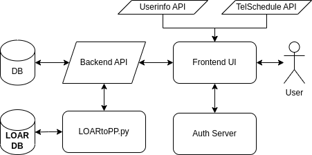

P-Squared Front End and API Deployment
======================================

High Level Architecture
-----------------------

P-Squared interfaces with several APIs, which access data stored in different areas. 

When a User Logs On
^^^^^^^^^^^^^^^^^^^

Upon entering the site, the user is immediately routed to the authentication server where they log in. Upon successful login, they are brought back
to the People Planner with an authentication cookie. This cookie is used to obtain a user's information from the Staffinfo API, 
allowing P^2 to customize the user's instance with their information.

When making the date-time table, P^2 obtains a list of employees from the telSchedule. Each Employee item contains information that 
P^2 uses to populate entry forms. Once obtained, the table is created where each row represents an employee. 

Next the entries are requested by P^2's API. The API in turn queries the database for employee schedules. The API returns the schedules,
which then populates the table. One thing worth mentioning is that the API fills in the gaps between events with default entries for 
most of the employees. For instance an employee who works at HQ normally from 8am-5pm will have that event on the table, even when the Entry
is not stored in the database.  This is also the case for night staff.  Their default entries are retrieved from the nightStaff database table and returned as events by the P^2 API.

The process described is repeated each time the user accesses the site, with the exception of the authentication step if their browser is
caching a valid authentication cookie. See figure below for diagram of the process just described.

Architectural view of p-squared and how it interfaces with other elements. 

Default Events
^^^^^^^^^^^^^^
Default events are returned by the P^2 API for the following cases, and only if an entry for the employee doesn't exist in the database table:

* HQ employees have a default shift defined in the all staff database table
* Night staff (OAs, NAs, SAs) have default shifts for their night support shifts defined in the nightStaff database table

Interface with LOAR
^^^^^^^^^^^^^^^^^^^

P^2 also runs a script that creates LOAR entries periodically in much of the same way as it creates night operation entries.

NGINX Configuration
-------------------

The following routes are defined in NGINX.

* www3.keck.hawaii.edu

location /api/pp {
    if ($http_referer !~ "https://www3.keck.hawaii.edu/(staff|observers)/*") {
        return 403;
    }
    proxy_pass https://vm-appserver.keck.hawaii.edu/api/pp;
}

* vm-appserver.keck.hawaii.edu

location /api/pp/ {
    proxy_pass http://vm-appserver.keck.hawaii.edu:39999/pp/;
}

Build and Release Procedure
---------------------------

* LOARtoPP.py is run as kcron on vm-hqcronserver.

Frontend
^^^^^^^^
While as webbld@vm-www3build navigate to ``path/to/project`` and enter the command ``npm run build``.
When complete the frontend will be in the ``build`` file. 

.. code-block:: bash 

   cd /wwwbuild/staff/p-squared/version
   git clone https://github.com/KeckObservatory/p-squared.git 
   npm install
   npm run build

There is a Makefile that is part of the repository that will release this build to the initial test environment with a rel link.  The release point is /www/staff/p-squared/version.

.. code-block:: bash

   make install

Test at `https://www3build.keck.hawaii.edu/staff/p-squared/rel/index.html <https://www3build.keck.hawaii.edu/staff/p-squared/rel/index.html>`_.
When ready, release to www3 using kdeploy.

.. code-block:: bash 

   kdeploy -a www/staff/p-squared

Backend
^^^^^^^

As webbld@vm-appserver, release to /api/peoplePortal/version
Update default link (i.e. 1-0-0 -> 1-0-1)

As webrun@vm-appserver

.. code-block:: bash 

  5,15,25,32,45,55 * * * * /usr/local/anaconda/bin/python /api/peoplePortal/default/manager.py pp_api start --port 39999 > /dev/null 2>&1
