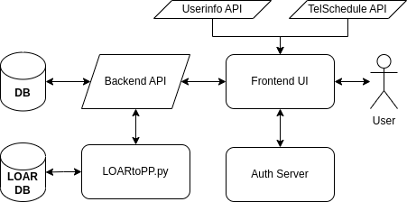

P-Squared Front End and API Deployment
======================================

High Level Architecture
-----------------------

P-Squared interfaces with several APIs, which access data stored in different areas. 

When a User Logs On
^^^^^^^^^^^^^^^^^^^

Upon entering the site, the user is immediately routed authentication server where they log in. Upon successful login, they are brought back
to the People Planner with an authentication cookie. This cookie is used to obtain a user's information from the Staffinfo API, 
allowing P^2 to customize the user's instance with their information.

When making the date-time table, P^2 obtains a list of employees from the telSchedule. Each Employee item contains information that 
P^2 uses to populate entry forms. Once obtained, the table is created where each row represents an employee. 

Next the entries are requested by P^2's API. The API in turn queries the database for employee schedules. The API returns the schedules,
which then populates the table. One thing worth mentioning is that the API fills in the gaps between events with default entries for 
most of the employees. For instance an employee who works at HQ normally from 8am-5pm will have that event on the table, even when the Entry
is not stored in the database.

The process described is repeated each time the user accesses the site, with the exception of the authentication step if their browser is
caching a valid authentication cookie. See figure below for diagram of the process just described.

Architectural view of p-squared and how it interfaces with other elements. 

Interface with LOAR and Night Operations
^^^^^^^^^^^^^^^^^^^^^^^^^^^^^^^^^^^^^^^^

For Night Attendants, Staff Astronomers, and Observation Assistants, P^2 periodically creates entries from the Night Table via a script. 
This script gathers the foretasted schedule and converts that schedule into P^2 entries that are stored on P^2's database.

P^2 also runs a script that creates LOAR entries periodically in much of the same way as it creates night operation entries.

Servers and Accounts
--------------------

Frontend
^^^^^^^^
* The frontend is built as webdev on www3build.

* LOARtoPP.py is run as kcron on vm-hqcronserver.

Backend
^^^^^^^

Build Procedure
---------------

Frontend
^^^^^^^^

Backend
^^^^^^^

Release Procedure
-----------------

Frontend
^^^^^^^^

Backend
^^^^^^^

Operations
----------

Installing Frontend 
-------------------

Some text 

Backend API
^^^^^^^^^^^

text

Database Deployment
-------------------

more Text 

Build Procedure
---------------

.. code-block:: python 

   from some python module 
   def fun(fileName):
      return fileName 

