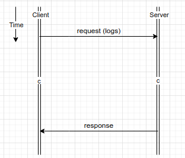
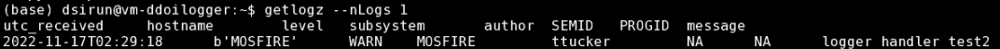

P-Squared Front End and API Deployment
======================================

High Level Architecture
-----------------------

Servers and Accounts
--------------------

Frontend
^^^^^^^^
The frontend is built as webdev on www3build.

Backend
^^^^^^^

Build Procedure
---------------

Frontend
^^^^^^^^

Backend
^^^^^^^

Release Procedure
-----------------

Frontend
^^^^^^^^

Backend
^^^^^^^

Operations
----------

Installing Frontend 
-------------------

Some text 

   some figure caption text

Backend API
^^^^^^^^^^^

text

Database Deployment
-------------------

more Text :download:`attached files <_static/logger_db.zip>` with ``mongorestore``.

Build Procedure
---------------

.. code-block::  python 

    from some python module 
    def fun(fileName):
        return fileName 

